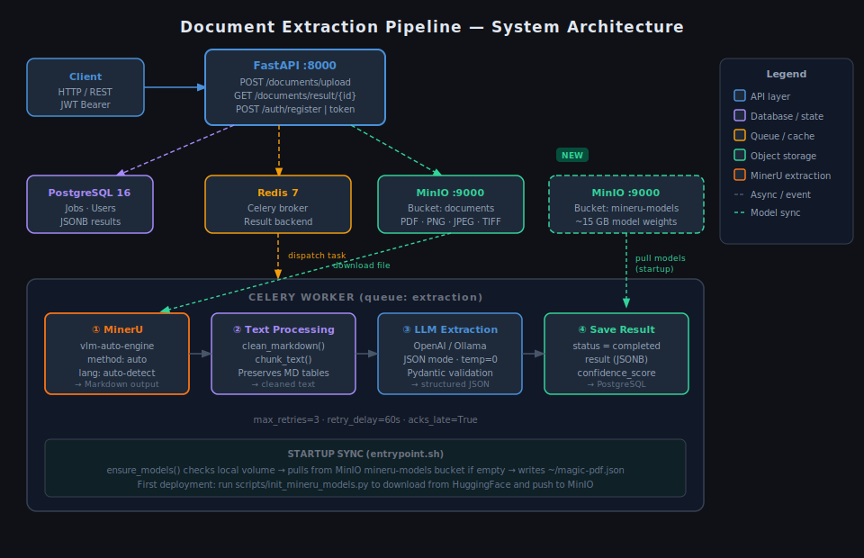
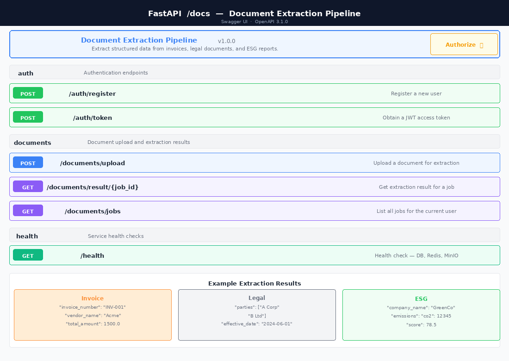

# Document Extraction Pipeline

A production-ready async system that extracts structured data from invoices, legal documents, and ESG reports using OCR and LLM.

## Architecture



## API Documentation



The interactive Swagger UI is available at `http://localhost:8000/docs` once the service is running.

---

## Features

- **Upload** PDF or image files (PNG, JPG, TIFF) up to 10 MB
- **Async processing** via Celery workers — no blocking API calls
- **Document extraction** with [MinerU](https://github.com/opendatalab/MinerU) (`vlm-auto-engine`) — preserves tables, headers, and multi-column layouts as structured Markdown
- **LLM extraction** using OpenAI (`gpt-4o-mini`) or Ollama (local models)
- **Structured output** for three document types: Invoice, Legal, ESG
- **JWT authentication** with per-user rate limiting (10 req/min)
- **MinIO** for file storage (S3-compatible)
- **PostgreSQL** for job tracking with JSONB result storage
- **Redis** as Celery broker and result backend

---

## Quick Start

### Prerequisites

- Docker and Docker Compose
- An OpenAI API key **or** a running Ollama instance

### 1. Clone and configure

```bash
git clone https://github.com/aiwithvd/document-extraction-pipeline.git
cd document-extraction-pipeline
cp .env.example .env
```

Edit `.env` and set at minimum:

```env
JWT_SECRET_KEY=your-strong-random-secret-here
OPENAI_API_KEY=sk-...         # if using OpenAI
```

### 2. Bootstrap MinerU models (first time only)

MinerU requires ~15 GB of model weights. Download them from HuggingFace and push to MinIO so all workers can pull them at startup:

```bash
# Install dependencies first (or use a temporary venv)
pip install -r requirements.txt

# Start MinIO only, then run the bootstrap
docker-compose up minio minio-models-init -d
python scripts/init_mineru_models.py --local-dir /tmp/mineru_models
```

This only needs to be done **once**. Models are stored in the `mineru-models` MinIO bucket and synced to each worker container automatically on every subsequent start.

### 3. Start all services

```bash
docker-compose up --build
```

This starts: FastAPI (port 8000), Celery worker, PostgreSQL, Redis, MinIO (port 9000 / console 9001). Database migrations run automatically on API startup. The worker pulls MinerU models from MinIO before accepting jobs.

### 3. Verify

```bash
curl http://localhost:8000/health
# {"status":"healthy","checks":{"database":"ok","redis":"ok","storage":"ok"}}
```

---

## API Usage

### Register and get a token

```bash
# Register
curl -X POST http://localhost:8000/auth/register \
  -H "Content-Type: application/json" \
  -d '{"email": "dev@example.com", "password": "secure123"}'

# Get JWT
curl -X POST http://localhost:8000/auth/token \
  -H "Content-Type: application/x-www-form-urlencoded" \
  -d "username=dev@example.com&password=secure123"
# → {"access_token": "<TOKEN>", "token_type": "bearer"}
```

### Upload a document

```bash
curl -X POST http://localhost:8000/documents/upload \
  -H "Authorization: Bearer <TOKEN>" \
  -F "file=@invoice.pdf" \
  -F "document_type=invoice"
# → {"id": "3f2b1c...", "status": "pending", "document_type": "invoice", ...}
```

### Poll for the result

```bash
curl http://localhost:8000/documents/result/3f2b1c... \
  -H "Authorization: Bearer <TOKEN>"
```

**Pending:**
```json
{"id": "3f2b1c...", "status": "pending", "result": null}
```

**Completed:**
```json
{
  "id": "3f2b1c...",
  "status": "completed",
  "confidence_score": 0.94,
  "result": {
    "invoice_number": "INV-2024-001",
    "date": "2024-03-15",
    "vendor_name": "Acme Corporation",
    "total_amount": 4850.00,
    "currency": "USD",
    "line_items": [
      {"description": "Consulting", "quantity": 2, "unit_price": 2000, "total": 4000},
      {"description": "Expenses",   "quantity": 1, "unit_price": 850,  "total": 850}
    ]
  }
}
```

### List all your jobs

```bash
curl "http://localhost:8000/documents/jobs?skip=0&limit=20" \
  -H "Authorization: Bearer <TOKEN>"
```

---

## Extraction Schemas

### Invoice

| Field | Type | Description |
|-------|------|-------------|
| `invoice_number` | string | Invoice identifier |
| `date` | date | Issue date (YYYY-MM-DD) |
| `vendor_name` | string | Vendor / supplier name |
| `total_amount` | float | Total amount (no currency symbol) |
| `line_items` | array | List of line items |
| `currency` | string | 3-letter currency code |

### Legal Document

| Field | Type | Description |
|-------|------|-------------|
| `parties` | string[] | Contracting parties |
| `effective_date` | date | When the agreement takes effect |
| `terms` | string[] | Key clauses / obligations |
| `jurisdiction` | string | Governing jurisdiction |
| `document_title` | string | Document title |

### ESG Report

| Field | Type | Description |
|-------|------|-------------|
| `company_name` | string | Reporting company |
| `emissions` | object | Metric name → numeric value |
| `sustainability_score` | float | 0–100 score |
| `reporting_year` | int | Year of report |
| `frameworks` | string[] | Standards used (GRI, TCFD, etc.) |

---

## Switching LLM Provider

### OpenAI (default)

```env
LLM_PROVIDER=openai
OPENAI_API_KEY=sk-...
OPENAI_MODEL=gpt-4o-mini
```

### Ollama (local, free)

```env
LLM_PROVIDER=ollama
OLLAMA_BASE_URL=http://localhost:11434
OLLAMA_MODEL=llama3
```

Start Ollama locally:

```bash
docker run -d -p 11434:11434 --name ollama ollama/ollama
docker exec ollama ollama pull llama3
```

Or add it to `docker-compose.yml`:

```yaml
ollama:
  image: ollama/ollama
  ports: ["11434:11434"]
  volumes: [ollama_data:/root/.ollama]
```

---

## Project Structure

```
app/
  main.py              # FastAPI app factory, lifespan, middleware
  api/
    deps.py            # Shared FastAPI dependencies
    routes/
      auth.py          # POST /auth/register, POST /auth/token
      documents.py     # POST /upload, GET /result/{id}, GET /jobs
      health.py        # GET /health
  core/
    config.py          # All settings (pydantic-settings)
    database.py        # Async SQLAlchemy engine + session
    security.py        # JWT + bcrypt
    storage.py         # MinIO client wrapper
    redis_client.py    # Async Redis pool
    celery_app.py      # Celery configuration
    logging.py         # structlog setup + CorrelationId middleware
  models/
    user.py            # User ORM model
    job.py             # Job ORM model (status, result JSONB, etc.)
  schemas/
    auth.py            # TokenRequest, UserCreate, UserResponse
    job.py             # JobStatus, DocumentType, JobResponse
    documents.py       # InvoiceExtraction, LegalExtraction, ESGExtraction
  services/
    mineru_service.py  # MinerU extraction (vlm-auto-engine, async via executor)
    llm_service.py     # OpenAI / Ollama extraction + retry + confidence
    job_service.py     # Job CRUD
  workers/
    tasks.py           # process_document Celery task
    sync_db.py         # Sync DB session for Celery
  utils/
    text_processing.py # clean_markdown() for MinerU output, chunk_text()
    model_sync.py      # push/pull/ensure_models — MinIO ↔ local volume sync
    validators.py      # File type (magic bytes), size, storage key
    prompts.py         # LLM prompt templates
    exceptions.py      # Custom exception hierarchy
alembic/               # DB migrations
scripts/
  init_mineru_models.py  # One-time: download MinerU models → push to MinIO
tests/
  unit/                # Isolated unit tests (mocked externals)
  integration/         # API-level tests (mocked DB + storage)
docker/
  api/Dockerfile
  worker/Dockerfile
  worker/entrypoint.sh # Model sync + Celery start
docker-compose.yml
```

---

## Development Setup (without Docker)

```bash
python -m venv .venv && source .venv/bin/activate
pip install -r requirements-dev.txt

# Start infrastructure
docker-compose up postgres redis minio minio-init minio-models-init -d

# Copy and edit env
cp .env.example .env

# Run migrations
alembic upgrade head

# Start API
uvicorn app.main:app --reload

# Start worker (separate terminal)
celery -A app.core.celery_app worker --loglevel=info -Q extraction -c 2
```

---

## Running Tests

```bash
pip install -r requirements-dev.txt
pytest tests/ -v --cov=app --cov-report=term-missing
```

Run only unit tests:

```bash
pytest tests/unit/ -v
```

Run only integration tests:

```bash
pytest tests/integration/ -v
```

---

## Configuration Reference

| Variable | Default | Description |
|----------|---------|-------------|
| `LLM_PROVIDER` | `openai` | `openai` or `ollama` |
| `OPENAI_API_KEY` | — | Required when using OpenAI |
| `OLLAMA_BASE_URL` | `http://localhost:11434` | Ollama base URL |
| `OLLAMA_MODEL` | `llama3` | Model name for Ollama |
| `JWT_SECRET_KEY` | — | Required, min 32 chars recommended |
| `JWT_EXPIRE_MINUTES` | `60` | Token expiry |
| `MAX_FILE_SIZE_BYTES` | `10485760` | 10 MB limit |
| `RATE_LIMIT_PER_MINUTE` | `10` | Per-user upload limit |
| `MINIO_BUCKET` | `documents` | Storage bucket name |
| `MINERU_MODELS_BUCKET` | `mineru-models` | MinIO bucket for MinerU model weights |
| `MINERU_MODELS_DIR` | `/app/models/mineru` | Local path where models are cached |
| `MINERU_DEVICE` | `cuda` | `cuda` or `cpu` — auto-detected by vlm-auto-engine |
| `ENVIRONMENT` | `production` | `development` enables CORS + verbose logs |

---

## Security Notes

- File MIME type is detected from **magic bytes**, not file extension
- All files stored under `uploads/{user_id}/{date}/{uuid}_{filename}` — no direct path exposure
- JWT tokens are short-lived (default 60 min) and user-scoped
- Rate limiting is keyed on authenticated user ID, not IP
- Passwords stored as bcrypt hashes (cost factor 12)
- Non-root Docker user (`appuser`, UID 1000)